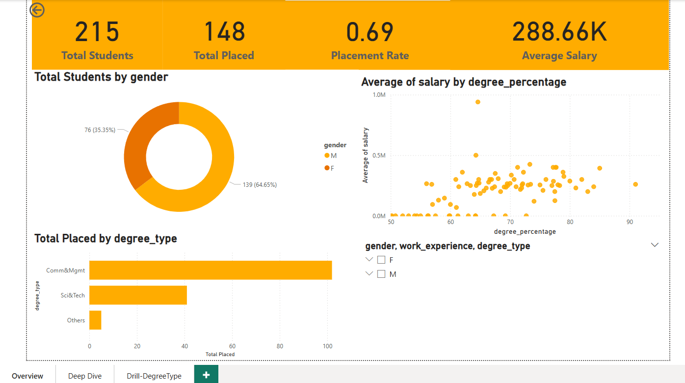

# 🎓 Indian Campus Placement Dashboard (Power BI)

This Power BI dashboard analyzes campus placement trends based on degree type, stream, gender, and work experience using a Kaggle dataset.

## 🔍 Features
- Drillthrough by Degree Type
- KPIs: Placement Rate, Avg Salary
- Interactive charts for Gender, Stream, and Work Experience
- Insights into what affects job offers and salaries

## 📁 Files
- `Campus_Placement_Dashboard.pbix`: Full Power BI report
- `screenshots/`: Visuals of dashboard pages

## 📊 Dataset
- [Kaggle - Campus Placement Data](https://www.kaggle.com/datasets/benroshan/factors-affecting-campus-placement)

## 🧠 Tools Used
- Power BI Desktop
- DAX (Data Analysis Expressions)
- Data Cleaning in Power Query

## 📸 Preview

---

